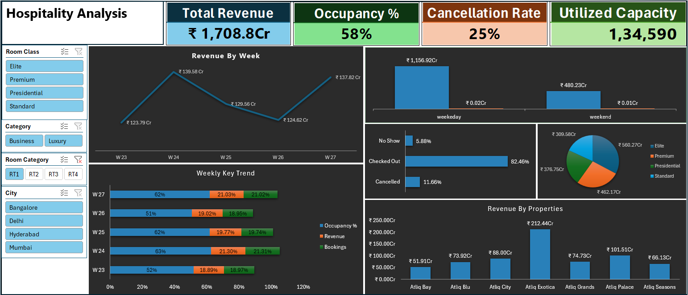
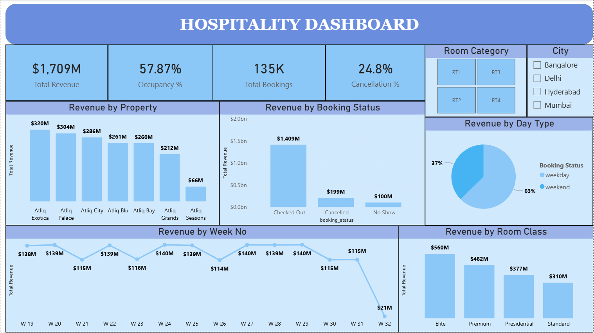

📊 Hospitality Performance Analysis (Excel + Power BI + SQL)
📌 Overview

This project delivers a comprehensive analysis of hospitality data using both Excel and Power BI dashboards.

It demonstrates end-to-end analytics:

Data cleaning

Transformation

Visualization

Business insight generation

The goal is to evaluate revenue performance, occupancy trends, and customer behavior to support data-driven decision-making.

🎯 Objectives

Analyze revenue trends across properties and time

Evaluate occupancy and capacity utilization

Identify cancellation patterns and revenue leakage

Compare weekday vs weekend performance

Deliver actionable business insights

🧰 Tools & Technologies

Excel → Operational dashboard & exploratory analysis

SQL → Data extraction and transformation

Power BI → Analytical dashboard, data modeling, DAX

📊 Excel Dashboard

📸 Preview

  

🔍 Highlights

Interactive slicers (City, Room Class, Category)

Weekly revenue trends

Occupancy vs bookings vs revenue comparison

Property-level performance

📊 Power BI Dashboard
📸 Preview

  

⚡ Features

Clean KPI tracking (Revenue, Occupancy, Bookings, Cancellation)

Revenue breakdown by:

Property

Booking status

Room class

Weekly trend analysis

Interactive filtering and cross-highlighting

📥 Access Dashboard

👉 <a href="Hospitality Analysis Dashboard.xlsx">Download Excel Dashboard</a>

👉 <a href="Hospitality Dashboard.pbix">Download Power BI Dashboard</a>

📊 Key Metrics

Total Revenue: ₹1,708 Cr

Occupancy Rate: ~58%

Cancellation Rate: ~25%

Total Bookings: ~135K

🔍 Key Insights

Weekday revenue significantly exceeds weekend performance

Cancellation rate (~25%) indicates notable revenue leakage

Certain properties (e.g., Atliq Exotica) dominate revenue contribution

Luxury and premium room classes generate the highest revenue

Occupancy (~58%) suggests room for optimization

⭐ If you found this useful

Give it a ⭐ on GitHub and feel free to connect!
